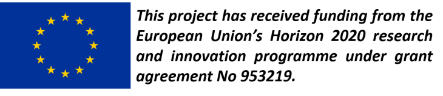

[Start page](README.md) | [Documentation](documentation.md) | [Download](download.md)

-------------------------

# SOFTware-Analyser for Industrial Stress (SOFT-AIS) 

This repository represents the home for the software developed within the [EASI-STRESS](https://easi-stress.eu/) project. It is used to analyse neutron and synchrotron X-ray data.

## Reporting bugs or asking for help
---------------------------------

This software is still under development. Therefore, please report any bugs or ask for help by creating a new [issue](https://github.com/aapaecklar/SOFT-AIS/issues).

## Funding
-------

